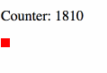

# Spock-Websockets

This is a simple proof-of-concept web app that demonstrates the use of [websockets](https://en.wikipedia.org/wiki/WebSocket) with the [Haskell](https://haskell.org/) [Spock](http://spock.li) library.

### Main libraries used

- [Spock](http://spock.li), a lightweight [Haskell](https://haskell.org/) web framework
- [websockets](https://hackage.haskell.org/package/websockets), a sensible and clean way to write WebSocket-capable servers in Haskell

### Demo

The source code contains a simple demo that streams the sequence of numbers that are displayed in the browser with a visual gimmick.



### How it works

The key thing to realize is that [websocketsOr](https://hackage.haskell.org/package/wai-websockets-3.0.1.2/docs/Network-Wai-Handler-WebSockets.html#v:websocketsOr) produces a [Middleware](https://hackage.haskell.org/package/wai-3.2.1.2/docs/Network-Wai.html#t:Middleware)

```haskell
type Middleware = Application -> Application	-- Network.Wai
```

like so

```haskell
wsMiddleware :: Middleware
wsMiddleware =  websocketsOr defaultConnectionOptions wsApp
    where ...
```

The `ServerApp` is 

```haskell
wsApp :: ServerApp
	wsApp pendingConn = do
	conn <- acceptRequest pendingConn
	counter conn 1
```

and `go` is an endless recursion (loop) that just counts up:

```haskell
counter :: Connection -> Int -> IO ()
counter conn i = do
    threadDelay 50000   -- 50ms
    sendTextData conn (T.pack $ show i)
    counter conn (i + 1)
```

This is tied in with the Spock app by defining the `appMiddlewares`

```haskell
appMiddlewares = do
    middleware (staticPolicy $ noDots >-> addBase "static")
    middleware wsMiddleware
```

and starting Spock

```haskell
runSpock 8080 (spock spockConfig (appMiddlewares >> app))
```

